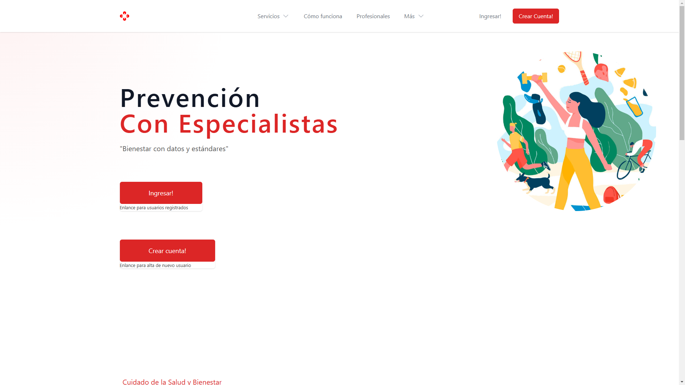

<h1 align="center">Cardio EPA Bienestar IA</h1>
<p align="center">A free and open-source healthcare webapp from the Medplum team.</p>
<p align="center">
  <a href="https://github.com/medplum/foomedical/actions">
    
  </a>
  <a href="https://github.com/medplum/foomedical/blob/main/LICENSE.txt">
    
  </a>
</p>



### What is Cardio EPA Bienesar IA a fork Foo Medical?

[Cardio EPA Bienestar IA](https://cardio.epa-bienestar.coma.ar/) is a **ready to use medical practice sample app** that's open source. It's meant for developers to clone, customize and run.

### Features

- Completely free and open-source
- Secure and compliant [EPA Bienestar IA](https://app.epa-bienestar.com.ar) backend, which is also open source
- Patient registration and authentication
- Health records
  - Lab results
  - Medications
  - Vaccines
  - Vitals
- Patient-provider messaging
- Care plans
- Patient scheduling
- All data represented in [FHIR](https://hl7.org/FHIR/)

Cardio EPA Bienestar IA is designed to be forked and customized for your business' needs. Register on [cardio.epa-bienestar.com.ar](https://cardio.epa-bienestar.com.ar/) to see it in action.

### Getting Started

First, [fork](https://github.com/medplum/drdalessandro/cardio/fork) and clone the repo.

Next, install the app from your terminal

```bash
npm install
```

Next, run the app

```bash
npm run dev
```

This app should run on `http://localhost:3000/`

### Account Setup

By default, your locally running Cardio EPA Bienestar IA app is pointing to the hosted EPA Bienestar IA service. Cardio registers signups to a test project.

To send patients to your own organization you will need to [register a new Project on EPA Bienestar IA](https://docs.medplum.com/tutorials/app/register) and configure your app [register form component](https://docs.medplum.com/storybook/index.html?path=/docs/medplum-registerform--basic) in [src/pages/RegisterPage.tsx](https://github.com/medplum/foomedical/blob/main/src/pages/RegisterPage.tsx#L23-L29) and [src/pages/SignInPage.tsx](https://github.com/medplum/foomedical/blob/221dda547b977205cf185131f592fb937535148a/src/pages/SignInPage.tsx#L22-L26) to point to your own project.

If you are using the Medplum Hosted service, you will also have to contact the medplum team ([admin@epa-bienestar.com](mailto:admin@epa-bienestar.com) or [Discord](https://discord.gg/UBAWwvrVeN])) to with the following information to set up your Project for Open Patient Registration:

- Medplum Project Id
- Google Client Id
- Google Client Secret
- Recaptcha Site Key
- Recaptcha Secret Key

Contact us on [Discord Server](https://discord.gg/UBAWwvrVeN) with any questions.

### Data Setup

When you log into Foo Medical a set of sample FHIR records is created on your behalf. The ability to run automations is part of the Medplum platform using a framework called [Bots](https://docs.medplum.com/app/bots). For reference, Bot that created the records in Foo Medical can be found [here](https://github.com/medplum/medplum-demo-bots/blob/main/src/examples/sample-account-setup.ts).

### Compliance

Medplum backend is HIPAA compliant and SOC 2 certified. Getting an account set up requires registering on [medplum.com](https://www.medplum.com/). Feel free to ask us questions in real time on our [Discord Server](https://discord.gg/UBAWwvrVeN).

### About Medplum

[Medplum](https://www.medplum.com/) is an open-source, API-first EHR. Medplum makes it easy to build healthcare apps quickly with less code.

Medplum supports self-hosting, and provides a [hosted service](https://app.medplum.com/). [Foo Medical](https://foomedical.com/) uses the hosted service as a backend.

- Read our [documentation](https://docs.medplum.com/)
- Browse our [react component library](https://docs.medplum.com/storybook/index.html?)
- Join our [Discord](https://discord.gg/UBAWwvrVeN)
# prevencion
# prevencion
